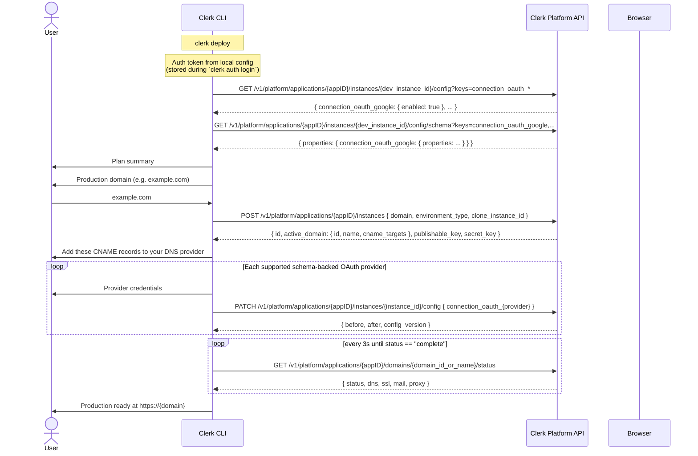

# Deploy Command

> **Live PLAPI lifecycle.** Human mode resolves the linked application, production domains, domain status, and instance config from the Platform API on each run. The production-instance lifecycle calls (`instances` and domain `status`) call the helpers in `lib/plapi.ts` directly. PLAPI error codes are translated to typed `CliError`s by `commands/deploy/errors.ts`.

Guides a user through deploying their Clerk application to production.

When the CLI reaches the DNS configuration step, it displays the required CNAME records and then prompts the user to export those records as a BIND zone file (`./clerk-<domain>.zone`). The prompt defaults to "no" and the file is overwritten silently on subsequent runs. On new deploys, this handoff happens before OAuth setup so DNS propagation can start while the user configures providers.

After all OAuth providers are configured, DNS verification checks DNS, SSL, and email DNS from the same domain status response. The wizard uses one shared exponential-backoff loop instead of waiting for each component separately. If polling times out, the retry handoff lists only DNS records tied to still-pending DNS-backed checks. For example, when DNS and email DNS are verified but SSL is still pending, the CLI shows green checks for the verified components and does not reprint already verified records.

## Usage

```sh
clerk deploy              # Interactive, idempotent wizard (human mode)
clerk deploy --verbose    # With debug output
clerk deploy --mode agent # Emit a read-only handoff for agents
clerk deploy status        # Verify deploy completion without prompts
clerk deploy status --mode agent --wait # Agent verification with retrying wait
```

## Global Options

| Flag        | Purpose                                      |
| ----------- | -------------------------------------------- |
| `--verbose` | Show detailed deploy and PLAPI debug output. |

## Agent Mode

When running `clerk deploy` in agent mode (`--mode agent`, `CLERK_MODE=agent`, or non-TTY context), the command emits a structured JSON handoff via `log.data` on stdout. The handoff is read-only: it resolves the linked app, production instance, domain, domain status snapshot, and OAuth completeness, but it does not prompt, mutate config, trigger a DNS check, or poll.

The handoff state is one of:

| State                 | Meaning                                                                                         |
| --------------------- | ----------------------------------------------------------------------------------------------- |
| `not_started`         | No production instance exists. Ask the human to run `clerk deploy`, then verify afterward.      |
| `domain_provisioning` | A production instance exists, but PLAPI has not returned a production domain yet.               |
| `domain_pending`      | A production domain exists, but DNS, SSL, email DNS, or final server-side readiness is pending. |
| `oauth_pending`       | The domain is verified, but supported OAuth providers still need production credentials.        |
| `complete`            | Production is deployed and verified.                                                            |

Agent-mode `clerk deploy` exits successfully for linked projects because it is informational. The pass/fail gate is `clerk deploy status`.

### `clerk deploy status`

`clerk deploy status` is the read-only verification command for agents and automation. It resolves the same live deploy state, triggers a DNS check for active production domains, and reports DNS, SSL, email DNS, and OAuth completeness. Human mode waits with the shared exponential-backoff poll loop; agent mode performs one quick DNS check and returns the resulting status immediately by default. Pass `--wait` in agent mode to wait with the same poll loop: one immediate status read, then up to 5 retries with exponential backoff.

In agent mode, `clerk deploy status` emits JSON on stdout with:

- `complete`: `true` only when the domain is verified and all supported OAuth providers enabled in development have production credentials.
- `state`: `complete`, `domain_pending`, `oauth_pending`, `domain_provisioning`, or `not_started`.
- `domainStatus`: per-component DNS, SSL, and email DNS status when a domain exists.
- `pendingDnsRecords`: CNAME records still tied to pending DNS-backed checks.
- `oauth`: configured, pending, and unsupported provider slugs.
- `nextAction`: the next step an agent should present to the user, including the Clerk Dashboard domains URL when a production instance exists. Agents should ask whether to open that URL for the user.

Exit codes:

| Exit | Meaning                                                                                       |
| ---- | --------------------------------------------------------------------------------------------- |
| `0`  | Deploy is complete and verified.                                                              |
| `1`  | The check ran successfully, but deploy is incomplete. Inspect `state` and `nextAction`.       |
| else | A real CLI error occurred, such as not linked or an API failure, via the standard error path. |

Agent mode is detected via the mode system (`src/mode.ts`), which checks in priority order:

1. `--mode` CLI flag
2. `CLERK_MODE` environment variable
3. TTY detection (`process.stdout.isTTY`)

The human-mode wizard still starts only in human mode.

## PLAPI Lifecycle

Human mode reads and writes deploy state through the Platform API on every run. The CLI does not persist deploy progress locally; the only profile write is the ordinary `instances.production` value once the production instance has been created.

| Step                       | Endpoint                                                                    | Behavior                                                                                                                                                                                                                                                                                                                     |
| -------------------------- | --------------------------------------------------------------------------- | ---------------------------------------------------------------------------------------------------------------------------------------------------------------------------------------------------------------------------------------------------------------------------------------------------------------------------- |
| Create production instance | `POST /v1/platform/applications/{appID}/instances`                          | Returns `id`, `environment_type`, `active_domain`, `publishable_key`, `secret_key` (once), and timestamps. DNS records are read from `active_domain.cname_targets[]`.                                                                                                                                                        |
|                            |                                                                             | Performs clone feature compatibility validation before creating production resources. 402 `unsupported_subscription_plan_features` → `ERROR_CODE.PLAN_INSUFFICIENT` listing missing features. 409 `production_instance_exists` → CLI re-derives state via `fetchApplication` and falls through to `reconcileExistingDeploy`. |
| Trigger domain DNS check   | `POST /v1/platform/applications/{appID}/domains/{domainIDOrName}/dns_check` | Starts a server-side DNS check. `clerk deploy status` triggers this before resolving the live state. Agent-mode `clerk deploy status` returns after the post-trigger status snapshot by default; `--wait` polls active production domains with the shared retry loop. A 409 conflict means a check is already running.       |
| Poll domain status         | `GET /v1/platform/applications/{appID}/domains/{domainIDOrName}/status`     | Returns aggregate `status` plus nested DNS, SSL, email DNS, and proxy component status. The CLI drives one shared DNS verification loop over the full status response. The aggregate `status` guards proxy and other server-side readiness gates. It performs one immediate status read, then polls every 3s.                |
| Save OAuth credentials     | `PATCH /v1/platform/applications/{appID}/instances/{instanceID}/config`     | Returns the updated config snapshot. Used to persist production `connection_oauth_*` credentials.                                                                                                                                                                                                                            |

After displaying the DNS records block, when CNAME records are present the CLI prompts "Export DNS records as a BIND zone file? (y/N)". On yes, it writes `./clerk-<domain>.zone` in the current working directory. The file is a standard BIND fragment containing `$ORIGIN`, `$TTL 300`, and one fully-qualified CNAME per record. The default is "no" and the file is overwritten silently on subsequent runs. Most major DNS providers (Cloudflare, Route 53, Google Cloud DNS, and others) support importing BIND zone fragments. The same prompt appears on both new deploys and resumed deploys.

PLAPI errors are translated to typed `CliError`s by `commands/deploy/errors.ts`. The CLI does not auto-retry SSL issuance or email DNS verification beyond the shared DNS verification loop. When domain status polling times out with SSL or email DNS still incomplete, the CLI surfaces the component status and instructs the user to rerun `clerk deploy` once DNS propagates.

If the user presses Ctrl-C after the production instance has been created, the wizard tells them to run `clerk deploy` again and exits with SIGINT code 130. The next run derives the current DNS or OAuth step from API state and resumes without starting another production instance.

## Sequence Diagram



## API Endpoints

All endpoints are on the **Platform API** (`/v1/platform/...`) and are live HTTP calls. The deploy command calls the helpers in `lib/plapi.ts` directly.

| Step                        | Method  | Endpoint                                                                 | Helper                                                                                                                                           |
| --------------------------- | ------- | ------------------------------------------------------------------------ | ------------------------------------------------------------------------------------------------------------------------------------------------ |
| Auth                        | n/a     | Local config                                                             | Token stored from `clerk auth login` or `CLERK_PLATFORM_API_KEY`.                                                                                |
| Read instance config        | `GET`   | `/v1/platform/applications/{appID}/instances/{instanceID}/config`        | `fetchInstanceConfig` from `lib/plapi.ts`. Discovers enabled `connection_oauth_*` providers.                                                     |
| Read instance config schema | `GET`   | `/v1/platform/applications/{appID}/instances/{instanceID}/config/schema` | `fetchInstanceConfigSchema`. Reads schemas for supported OAuth config keys so deploy can derive credential prompts.                              |
| Patch instance config       | `PATCH` | `/v1/platform/applications/{appID}/instances/{instanceID}/config`        | `patchInstanceConfig`. Writes production OAuth credentials.                                                                                      |
| Read application            | `GET`   | `/v1/platform/applications/{appID}`                                      | `fetchApplication`. Resolves development and production instance IDs.                                                                            |
| List production domains     | `GET`   | `/v1/platform/applications/{appID}/domains`                              | `listApplicationDomains`. Recovers production domain name and CNAME targets on each run.                                                         |
| Create production instance  | `POST`  | `/v1/platform/applications/{appID}/instances`                            | `createProductionInstance`. Returns prod instance, primary domain, keys, and DNS records nested under `active_domain.cname_targets[]`.           |
| Trigger domain DNS check    | `POST`  | `/v1/platform/applications/{appID}/domains/{domainIDOrName}/dns_check`   | `triggerApplicationDomainDNSCheck`. Called by the wizard and by `clerk deploy status`; agent mode waits briefly, then reads one status snapshot. |
| Poll domain status          | `GET`   | `/v1/platform/applications/{appID}/domains/{domainIDOrName}/status`      | `getApplicationDomainStatus`. Drives the wizard spinner and the human-mode `clerk deploy status` wait loop over the full domain status response. |

## OAuth Provider Config Format

Config keys follow the pattern `connection_oauth_{provider}`. When writing credentials to a production instance:

```json
PATCH /v1/platform/applications/{appID}/instances/production/config

{
  "connection_oauth_google": {
    "enabled": true,
    "client_id": "123456789-abc.apps.googleusercontent.com",
    "client_secret": "GOCSPX-..."
  }
}
```

### OAuth provider support

`clerk deploy` discovers enabled built-in OAuth providers from development config keys named `connection_oauth_{provider}`. For public built-in providers supported by the deploy flow, the command reads `GET /config/schema` and derives credential prompts from the provider schema.

Most providers ask for `client_id` and `client_secret`. Provider-specific schema fields are prompted when they are safe for deploy setup, such as Linear `actor`.

The CLI keeps small local overrides for provider setup details that schema does not fully describe:

| Provider | Override                                                                                   |
| -------- | ------------------------------------------------------------------------------------------ |
| Google   | Optional Google Cloud Console JSON import and OAuth consent screen warning                 |
| Apple    | `.p8` file import, production-required `team_id` and `key_id`, native-only field omissions |

For Google, the wizard can load `client_id` and `client_secret` from the top-level `web` object in a Google Cloud Console OAuth client JSON file, or from `installed` for desktop-style client downloads. The file contents are used in memory and are not written to CLI config.

Providers not currently supported by automated deploy setup are cloned to production without automated credential setup. Configure those providers from the Clerk Dashboard before going live.

Production instances return `422` if you try to enable a provider without credentials.

## Helpful values for OAuth walkthrough

When the user chooses the guided walkthrough, these values are derived from their domain:

| Field                         | Value                                      |
| ----------------------------- | ------------------------------------------ |
| Authorized JavaScript origins | `https://{domain}`, `https://www.{domain}` |
| Authorized redirect URI       | `{frontend_api_url}/v1/oauth_callback`     |

The redirect URI is served by the Frontend API (`clerk.{domain}`), not the Account
Portal (`accounts.{domain}`). Use the `frontend_api_url` returned on the domain
object rather than reconstructing it from the domain name.
