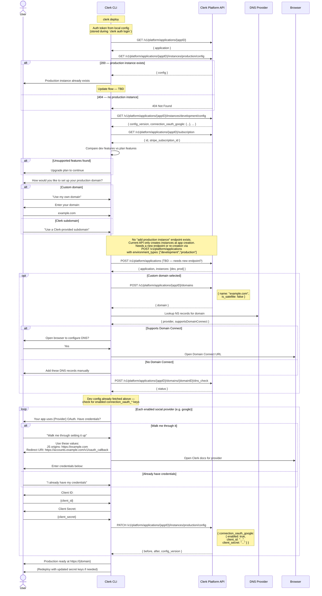

# Deploy Command

> **Fully mocked.** This command uses hardcoded test data and is not yet wired to real APIs. The interactive prompts are real, but all API calls (application lookup, instance creation, DNS, OAuth credential storage) are simulated.

Guides a user through deploying their Clerk application to production.

## Sequence Diagram



## API Endpoints

All endpoints are on the **Platform API** (`/v1/platform/...`).

| Step | Method | Endpoint | Notes |
|---|---|---|---|
| Auth | — | Local config | Token stored from `clerk auth login` |
| Get application | `GET` | `/v1/platform/applications/{appID}` | |
| Check prod instance | `GET` | `.../instances/production/config` | 404 if none exists |
| Read dev config | `GET` | `.../instances/development/config` | Returns all settings including `connection_oauth_*` keys |
| Subscription check | `GET` | `.../subscription` | Returns `{ id, stripe_subscription_id }` only — feature comparison is client-side |
| Create prod instance | `POST` | `/v1/platform/applications` | **Gap: no endpoint to add a production instance to an existing app** |
| Add domain | `POST` | `.../domains` | Body: `{ name, is_satellite }` |
| DNS check | `POST` | `.../domains/{domainID}/dns_check` | Triggers async DNS verification |
| Write OAuth creds | `PATCH` | `.../instances/production/config` | Body: `{ connection_oauth_{provider}: { enabled, client_id, client_secret } }` |

## API Gaps

### Creating a production instance for an existing app

The current Platform API only creates instances during application creation via `POST /v1/platform/applications` with the `environment_types` parameter:

```json
POST /v1/platform/applications
{
  "name": "my-app",
  "environment_types": ["development", "production"],
  "domain": "example.com"
}
```

There is **no endpoint** to add a production instance to an application that was originally created with only a development instance. This needs either:
1. A new `POST /v1/platform/applications/{appID}/instances` endpoint
2. Or a different approach (e.g., re-creating the application)

### Subscription feature comparison

`GET /v1/platform/applications/{appID}/subscription` returns only basic metadata (`id`, `stripe_subscription_id`), not feature lists. Feature detection is done server-side in `pkg/pricing/pricing.go` by inspecting instance config. The CLI would need either:
1. A new endpoint that returns the feature comparison result
2. Or access to plan feature lists to compare client-side

## OAuth Provider Config Format

Config keys follow the pattern `connection_oauth_{provider}`. When writing credentials to a production instance:

```json
PATCH /v1/platform/applications/{appID}/instances/production/config

{
  "connection_oauth_google": {
    "enabled": true,
    "client_id": "123456789-abc.apps.googleusercontent.com",
    "client_secret": "GOCSPX-..."
  }
}
```

### Provider-specific required fields

| Provider | Required Fields |
|---|---|
| Google | `client_id`, `client_secret` |
| GitHub | `client_id`, `client_secret` |
| Microsoft | `client_id`, `client_secret` |
| Apple | `client_id`, `client_secret`, `key_id`, `team_id` |
| Linear | `client_id`, `client_secret` |

Production instances return `422` if you try to enable a provider without credentials.

### Google OAuth `client_id` validation

Google enforces a pattern: `^[0-9]+-[a-z0-9]+\.apps\.googleusercontent\.com$`

## Helpful values for OAuth walkthrough

When the user chooses the guided walkthrough, these values are derived from their domain:

| Field | Value |
|---|---|
| Authorized JavaScript origins | `https://{domain}`, `https://www.{domain}` |
| Authorized redirect URI | `https://accounts.{domain}/v1/oauth_callback` |
